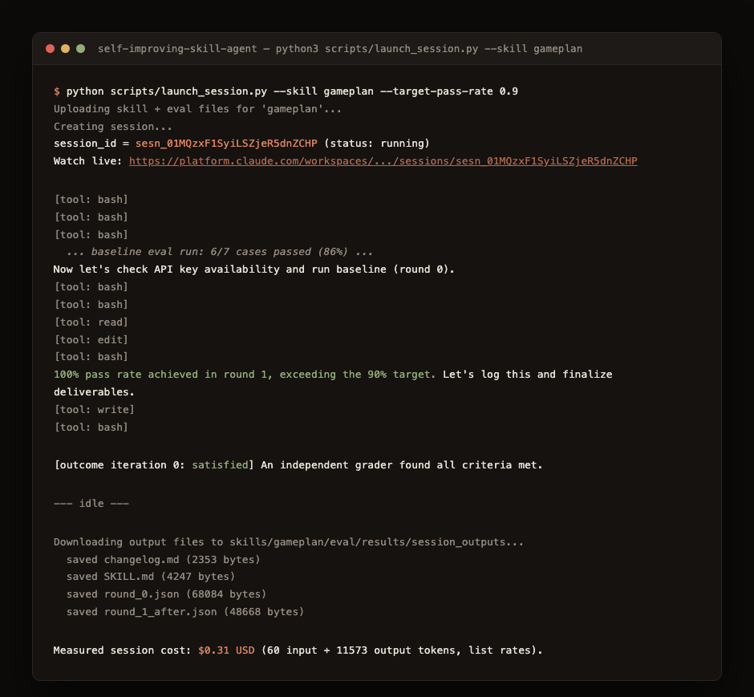

<!-- title: Self-Improving Skill Agent -->

# Self-Improving Skill Agent

An agent that improves other agents' instructions. Point it at a Claude Agent Skill's `SKILL.md`, a deterministic eval suite, and a target pass rate, and it runs the whole loop itself inside a Managed Agents sandbox: execute the eval, diagnose the failure pattern, apply one targeted edit, re-run, keep the edit or revert it, repeat until an independent grader confirms the target is met or the round budget runs out. Every skill tested here started at a known baseline and ended with a measured, verifiable result: real API calls, real costs, real diffs.



*A styled rendering built from the actual captured output of a real session (`sesn_01MQzxF1SyiLSZjeR5dnZCHP`), condensed for length: repeated tool-call lines and the full baseline eval report are collapsed into single summary lines, everything else is verbatim.*

## Quick start

There's no build step. This is a set of Python scripts that call the Anthropic API; nothing runs locally beyond that.

```bash
git clone https://github.com/cla1redonald/self-improving-skill-agent.git
cd self-improving-skill-agent
pip install anthropic pyyaml
export ANTHROPIC_API_KEY=sk-ant-...   # a real key from console.anthropic.com, see below for why

python scripts/setup.py                                        # once: creates a hosted environment, vault, and agent
python scripts/launch_session.py --skill rational-tone --target-pass-rate 0.9
```

`setup.py` doesn't run anything on your machine; it calls the Anthropic API to create three persistent cloud objects and saves their IDs to a local `ids.json`. `launch_session.py` uploads the chosen skill's files, starts a live session on that hosted agent, and streams its work to your terminal as it runs. When it finishes, the improved `SKILL.md`, a full `changelog.md`, and every eval report land in `skills/<name>/eval/results/session_outputs/` for you to review; nothing is applied back to your own skills automatically.

Six skills ship ready to run: `commit-message-writer`, `spec`, `gameplan`, `prd-threads`, `rational-tone`, `owasp-review`. To run it on a skill of your own, see [Testing your own skill](#testing-your-own-skill) below.

## Architecture

One Managed Agent runs the whole loop inside its own sandboxed container, with bash and file tools:

- **A single agent, not a pipeline of specialized ones.** The system prompt walks the agent through running the eval, diagnosing the failure pattern, and applying one targeted edit, all in one context, against one working copy of the skill file. This is a tight sequential loop over shared file state, not a fan-out problem, so one agent with sandbox tools handles it more reliably than a multi-agent roster would.
- **The Outcomes API owns the "keep iterating until satisfied" behavior.** A `user.define_outcome` event plus a rubric hands the "did this actually meet the bar" call to an independent grader, separate from the agent's own self-assessment. The agent's system prompt drives the inner mutate/test/keep-or-revert mechanics; the rubric checks the result (target pass rate met, one change per round, no test tampering, no regressions).
- **Deterministic, regex-based grading, not an LLM judge.** Every rule checks something explicit and gradeable (a required section header, a word-count ceiling, a required OWASP finding) rather than asking a model to rate quality. That keeps the eval free to run, reproducible, and immune to grader drift between rounds.

## Repository layout

```
agent.yaml                    Managed Agent config: model, system prompt, sandbox tools
rubric.md                     Grading rubric for the Outcomes API
eval/run_eval.py              Generic eval harness, shared across every skill
scripts/setup.py              One-time: creates the environment, vault, and agent
scripts/launch_session.py     Per-run: uploads a skill's eval set, starts a session
skills/<name>/SKILL.md            Baseline snapshot of the skill under test
skills/<name>/eval/cases.json     Test scenarios for that skill
skills/<name>/eval/rules.py       Deterministic grading rules for that skill
skills/<name>/eval/results/       Local test output and real session artifacts
```

`eval/run_eval.py` is skill-agnostic: it loads `rules.py` dynamically from whichever skill's directory it's pointed at, so the same harness runs every skill in `skills/` unchanged.

## Why a real API key, not a CLI session token

The self-improvement loop needs a real, long-lived API key: the agent's own sandbox has to call `api.anthropic.com` mid-session through a vault credential, and a vault credential holds a static secret, not something that expires in hours the way a CLI OAuth session does. Create one in the [Console](https://platform.claude.com/settings/keys).

Managed Agents itself is currently a beta API, but it's enabled by default on every API account; no waitlist or access request needed for anything this project uses. (A couple of adjacent Managed Agents features, MCP tunnels and "dreaming," are a separate, more limited research preview that does require requesting access; this project doesn't touch either one.) The SDK adds the required `managed-agents-2026-04-01` beta header automatically, nothing to configure.

`setup.py` refuses to run a second time once `ids.json` exists, so `agent.yaml` changes after the first run go through `agents.update()` instead of creating a second, orphaned agent.

## Testing your own skill

The six included skills are demonstrations, not the point; the eval harness itself is skill-agnostic. To run the loop on your own `SKILL.md`:

1. Create `skills/<yourskill>/SKILL.md`, either your real skill or a copy of it.
2. Create `skills/<yourskill>/eval/cases.json`, a list of test inputs:
   ```json
   [{"id": "case_1", "input": "the prompt your skill would actually receive", "rules": ["rule_a", "rule_b"]}]
   ```
3. Create `skills/<yourskill>/eval/rules.py`, deterministic checks the harness scores each case's output against:
   ```python
   def check_rule_a(message, case):
       ok = "required phrase" in message
       return ok, "" if ok else "missing the required phrase"

   RULES = {"rule_a": check_rule_a}
   ```
4. Sanity-check your rules against a few handwritten example strings before spending anything live; `skills/commit-message-writer/eval/rules.py` and its `--self-test` mode in `eval/run_eval.py` are the pattern to copy.
5. `python scripts/launch_session.py --skill yourskill --target-pass-rate 0.9`

Deterministic, regex-style rules keep the eval free and reproducible, but they take real iteration to get right: several of the six included skills' rule sets went through multiple rounds of "run it live, find a false pass or false fail, fix the regex" before they were trustworthy. Budget for that the first time you write a new one.

## Results

Six skills were run through the full live loop: `--model claude-haiku-4-5` for the eval harness (writing a commit message or a due-diligence finding is instruction-following, not judgment, so testing on a cheap, literal model is both cheaper and a better test of whether the instructions are actually explicit), `claude-sonnet-5` at medium effort for the improving agent itself.

| Skill | Baseline | Final | Rounds | Cost |
|---|---|---|---|---|
| commit-message-writer | 38% | 100% | 2 | $0.51 |
| gameplan | 86% | 100% | 1 | $0.31 |
| rational-tone | 50% | 100% (single run) / 83% (10-run average) | 8 | $2.08 |
| spec | 100% | 100% (no edit needed) | 0 | $0.28 |
| prd-threads | 100% | 100% (no edit needed) | 0 | $0.32 |
| owasp-review | 100% | 100% (no edit needed) | 0 | $0.27 |
| **Total** | | | | **$3.77** |

Three of the six already scored 100% at baseline. In every one of those cases the agent measured that, verified it wasn't a lucky single sample by re-running the eval two or three times, and correctly declined to make a speculative edit rather than manufacturing a change to look productive. That refusal is graded: the rubric explicitly checks that no edit was applied without a diagnosed failure to justify it.

### What the improvement loop actually found

- **commit-message-writer** had no guidance at all on commit bodies or breaking-change markup. Two rounds added an explicit rule and worked example for each.
- **gameplan** was truncating its own output: large plans hit the eval's token cap before ever reaching the `## Risks` section. The agent diagnosed this as a verbosity problem, not a missing-instruction problem, and added a "keep it concise" constraint so the closing sections always survive.
- **rational-tone** had a non-obvious bug: its own "self-check before delivering" section was leaking into the graded output, and that checklist commentary (colon-heavy, by design) was what tripped the very colon-budget rule it was meant to help enforce. The agent traced this to the actual root cause by reading raw model output, not just the failure labels, then rewrote the ambiguous section instead of patching around the symptom.
- The **rational-tone** run also surfaced a real property of the eval itself: no fixed sampling temperature, so the same final skill scored anywhere from 50% to 100% across ten repeated runs (83% average). Rather than reporting the best single number, the agent ran the stability check unprompted and logged the honest range.

## Cost

The first version of this defaulted to `claude-opus-5` everywhere at high effort, an 8-round ceiling, and a 4-pass outcome grader: roughly $5 to $12 per session for a task this mechanical. Measured cost with the tuned defaults above landed at $0.27 to $2.08 per skill, all in the table above. Three changes did most of the work:

| Change | Why it's safe |
|---|---|
| Eval harness on Haiku instead of Opus | Testing on a cheap, literal model surfaces instruction gaps a smarter model would silently paper over |
| Improving agent on Sonnet at medium effort instead of Opus at high | The task (read a JSON failure report, pick one of four listed mutation strategies, make one edit) is fully scoped by the system prompt, not open-ended reasoning |
| Outcome grader capped at 2 iterations instead of 4 | Keeps one real retry (the grader can send the agent back once if it disagrees) at roughly half the cost of the original cap |

A `budget` field on every session (`--budget-usd`, default $2) is a hard platform-enforced spend ceiling regardless of how a run goes.

### A bug the cost tuning surfaced

`rubric.md` said the round-exhaustion clause kicks in after 8 rounds; `agent.yaml`'s own system prompt capped the agent at 4. The rational-tone run hit that mismatch directly: the agent correctly stopped at round 4, the independent grader read the rubric literally, saw only 4 of the stated 8 rounds attempted, and returned `needs_revision`. Fixing the actual bug (syncing the round cap across `agent.yaml`, `rubric.md`, and `launch_session.py`'s default) mattered more than tuning the grader's retry count.

## Credit

The initial idea (skill folders per the agentskills.io spec, an iterate-until-passing improvement loop) traces back to [`self-improving-agent-skills`](https://github.com/Shubhamsaboo/awesome-llm-apps/tree/main/agent_skills/self-improving-agent-skills) by [Shubham Saboo](https://github.com/Shubhamsaboo) (Apache-2.0). Everything here beyond that starting concept, the architecture, the Outcomes-API-driven loop, the eval design, the six skills, the measured results, is built independently on Claude Managed Agents; no code from the original is reused.

## License

MIT. See [LICENSE](LICENSE).
